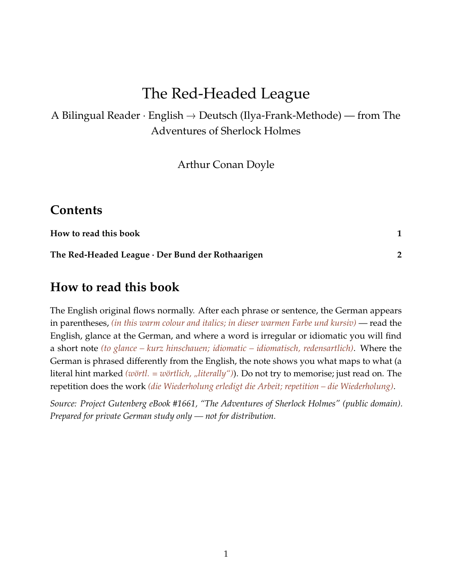
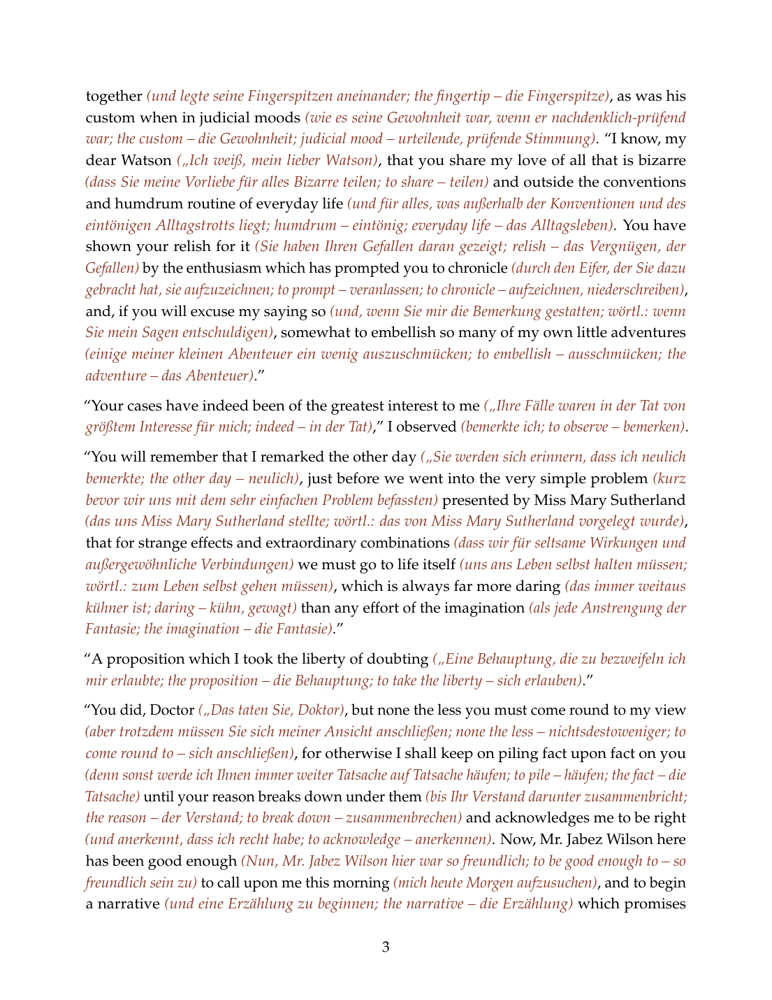
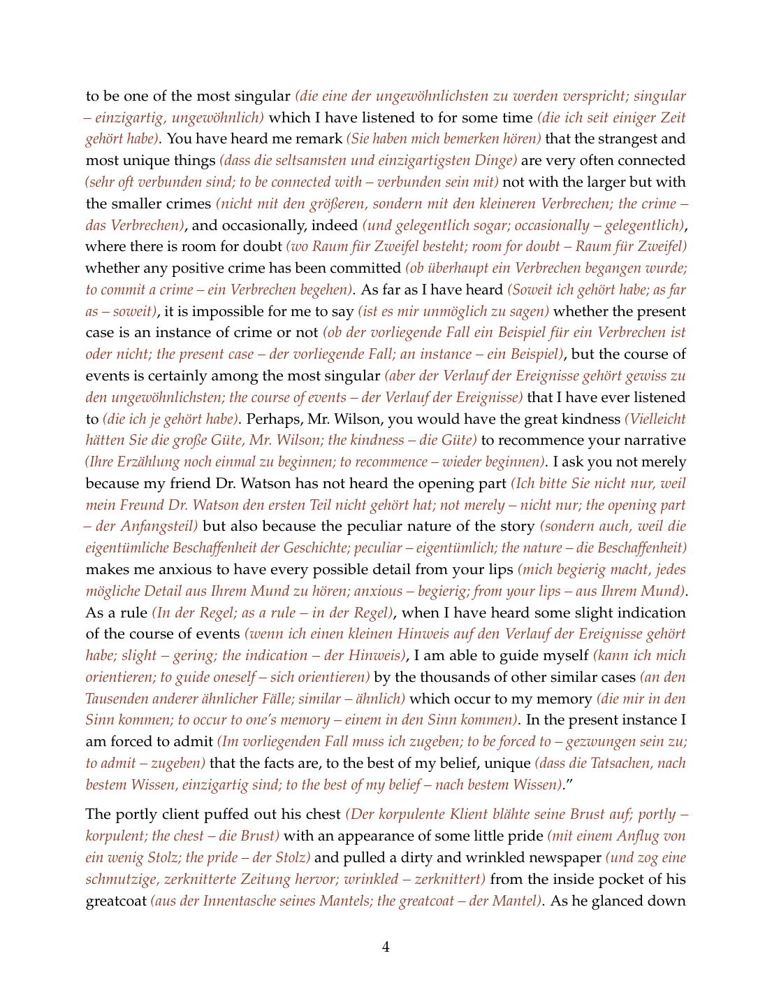
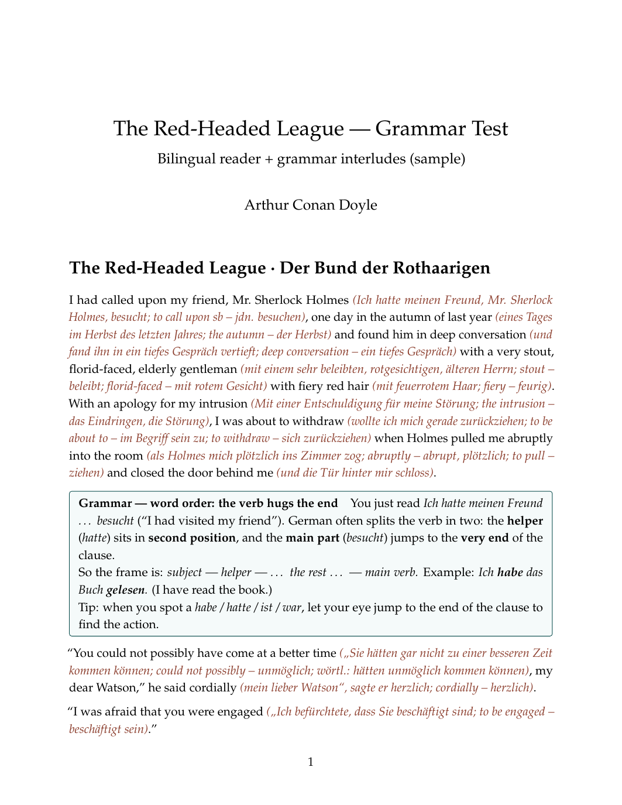
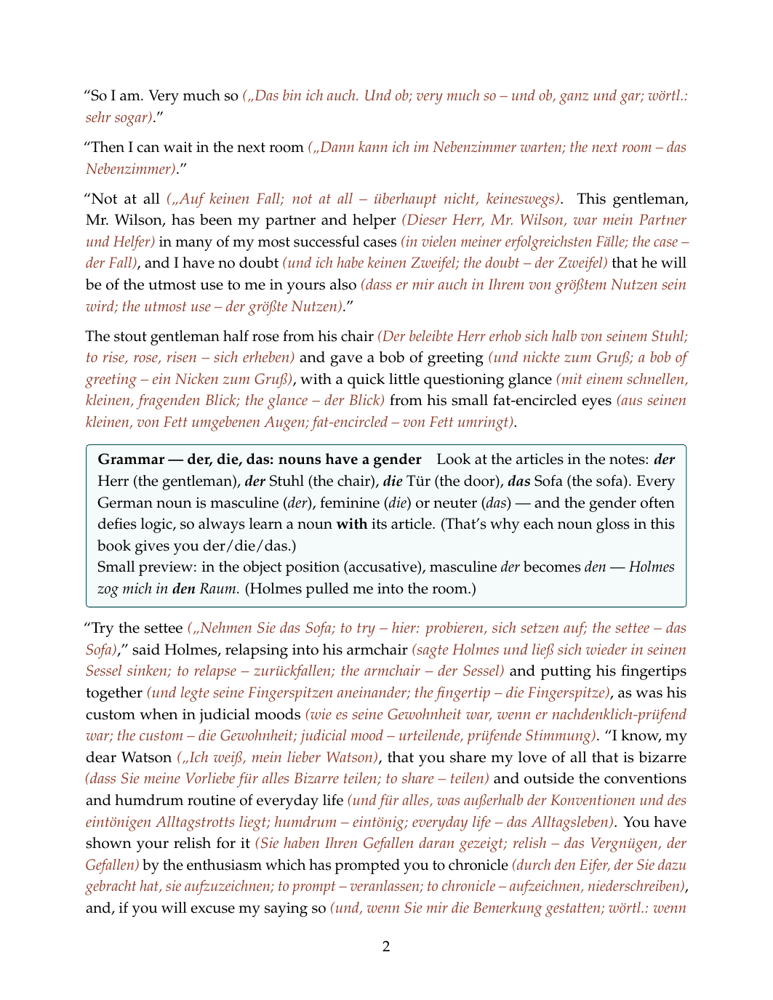

# BookBridge 📚

*Learn a language by reading the books you actually want to read, with the translation woven in.*

I've decided to learn German, and my preferred way isn't textbooks. It's
**reading real literature**: books good enough that the *story* pulls you along
and keeps you turning pages, so the language sinks in almost as a side effect.
The trouble is that jumping straight into a German novel as a beginner is brutal.

So this repo is the method I'm using to bridge that gap. It turns public-domain
books into **bilingual readers** in the **Ilya-Frank style**: the original
English text flows normally, and right after each small phrase the German
translation appears inline, in a warm colour, with tiny vocabulary and grammar
notes. You read the story for pleasure, glance at the German as you go, and the
words and patterns accumulate without drills or flashcards.

The newer direction is **German-first**: read the German as the main text, keep
English as inline support, and optionally generate read-aloud EPUBs with
synchronized ElevenLabs narration. The same cached audio can be packaged two
ways: fixed-layout for Apple Books, and reflowable for BookFusion. That audio
workflow is meant to be reusable for future books, not just one Dracula
experiment; the current scripts started inside the Dracula German-first book
folder and can be copied/promoted for the next book.

> The reading is the bait; the German is the catch.

## What it looks like

A page reads English-first, with the German woven in after each chunk and a
short note wherever a word is irregular, idiomatic, or just worth knowing:

> I had called upon my friend, Mr. Sherlock Holmes *(Ich hatte meinen Freund,
> Mr. Sherlock Holmes, besucht; to call upon sb – jdn. besuchen)*, one day in
> the autumn of last year *(eines Tages im Herbst des letzten Jahres; the
> autumn – der Herbst)* …

Sample pages from *The Red-Headed League* (from *The Adventures of Sherlock
Holmes*):

| Title & "how to read" | A story page |
|---|---|
|  |  |

A few things to notice:
- The German sits in parentheses, in a warm brick-red italic, right after the
  English it translates. The chunks are small, so you never lose track of which
  German goes with which English.
- After a `;` come the side-notes: the headword and its German, noun genders
  (`der/die/das`), irregular verb forms, and a literal `wörtl.: …` hint whenever
  the natural German reorders the English.
- Output comes as both **PDF** (fixed, print-ready) and **EPUB** (reflows on any
  e-reader or phone).

## Grammar, woven in (optional)

Reading teaches vocabulary and feel, but not the *rules*. So a book can also
include short **grammar interludes**: small teal "teacher's note" boxes that drop
in every few pages and explain **one** point, tied to a sentence you just read
(for example, why *ich hatte … besucht* puts the verb at the end). Over a whole
book they add up to a gentle grammar course, learned in context.

| First box (word order) | Two boxes in flow |
|---|---|
|  |  |

How it's tuned per book:
- **I choose the level range** (for example A1–A2, A2–B1, or a wide A1–B1), and
  the boxes follow a curriculum for that range.
- **The pace comes from the book's length**, roughly one box every **3 to 7
  pages**. If a book is too short to fit the whole curriculum at that pace, I'm
  told up front and it covers as much as fits.
- **Grammar is optional.** If I don't want it, I get the clean original format
  with just the bilingual text. The boxes render in both PDF (framed) and EPUB
  (styled).

## The method in one line

Pick a book whose story you actually want to read. Turn it into a bilingual,
phrase-by-phrase edition with generous vocabulary notes. Then just read it, again
and again. No memorising; the repetition does the work.

## What's in this repo

This repo holds the **procedure and tooling**, not the books themselves. The
generated readers are large and for personal study, so they're git-ignored.

- **`CLAUDE.md`**: the full project guide. The format rules, the toolchain, the
  step-by-step procedure, and how to ask for a new book on a fresh machine.
- **`instruction.md`**: the detailed playbook (extraction, translation, assembly,
  build, Apple Books read-aloud audio, and the gotchas learned along the way).
- **`build/`**: the generic build assets. They run entirely in a container (pandoc
  plus a small TeX, nothing installed on the laptop) and include the filters that
  colour the German, the page styling, and the PDF/EPUB build scripts.
- **`docs/`**: the sample screenshots above.
- **`sample.png`**: the original visual reference for the format.

## How a book gets made (short version)

1. Download a public-domain text from [Project Gutenberg](https://www.gutenberg.org).
2. Strip the boilerplate and split it into chapters or segments.
3. Translate it phrase-by-phrase into the bilingual format (idiomatic German,
   generous notes, literal bridges, correct du/Sie).
4. Assemble and build a **PDF and EPUB**, all inside a container.
5. For German-first read-aloud editions, extract German-only text, generate
   cached ElevenLabs chapter audio with timestamps, and package EPUB3 Media
   Overlay books for Apple Books fixed-layout and BookFusion reflowable reading.

Full details are in `CLAUDE.md` and `instruction.md`.

## Books made so far

*The Adventures of Sherlock Holmes* and *The Return of Sherlock Holmes* (Doyle),
*The Time Machine* (Wells), *Dracula* (Stoker), and *Frankenstein* (Shelley).

Roughly from easiest to hardest German: *The Time Machine*, then the Holmes
story collections, then *Dracula* (the longest), and finally *Frankenstein*
(ornate 1818 prose).

## A note on sources and use

Texts come **only** from Project Gutenberg and are in the **public domain**. The
bilingual editions are made for my own **personal language study**, not for sale
or distribution. The generated translations and the PDFs/EPUBs are intentionally
kept out of version control.
